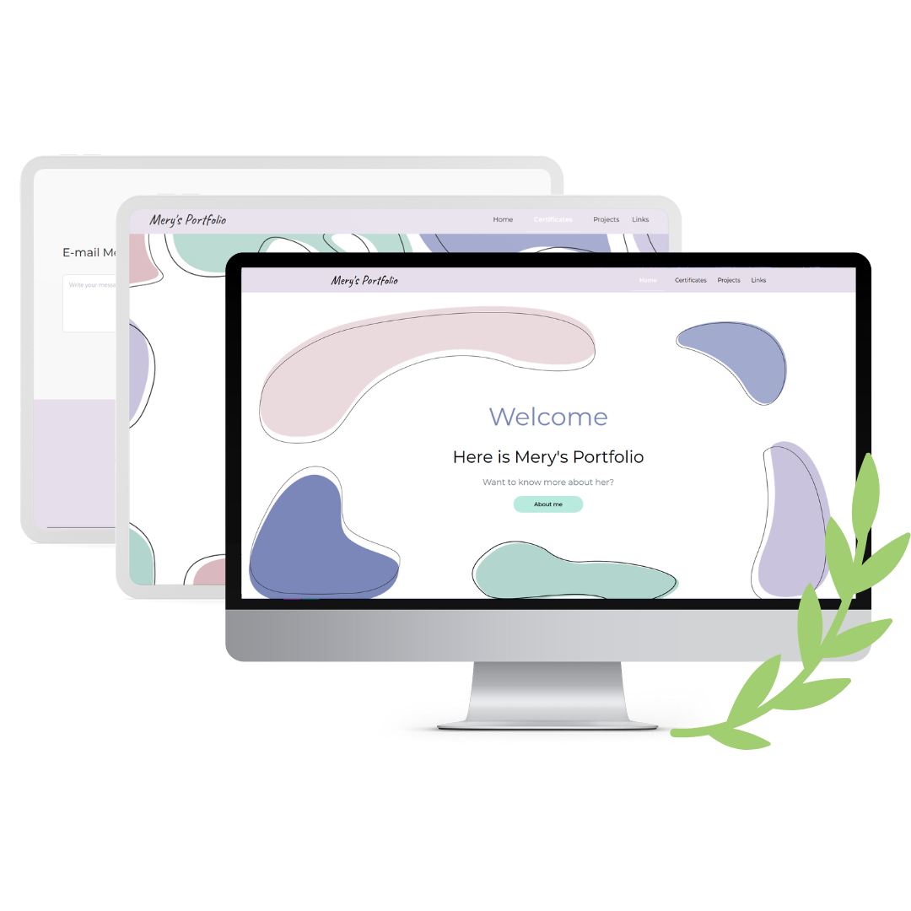

# Pastel Portfolio

A simple and elegant personal portfolio website built with a soft pastel color palette.  
Designed and developed by me to showcase my projects, skills, and contact information in a clean and modern layout.

## Features

- Pastel-themed UI for a calm visual experience
- Project showcase section
- About Me and Contact sections

## Design

The visual style, layout, and color palette were fully designed by me, inspired by a soft and minimalist pastel aesthetic.  
Focus was placed on readability, calm tones, and a friendly user experience.

## Built With

- React.js  
- Tailwind CSS 

## Preview

 <!-- Add a screenshot if you have one -->

You will find the project files in the dev branch.
